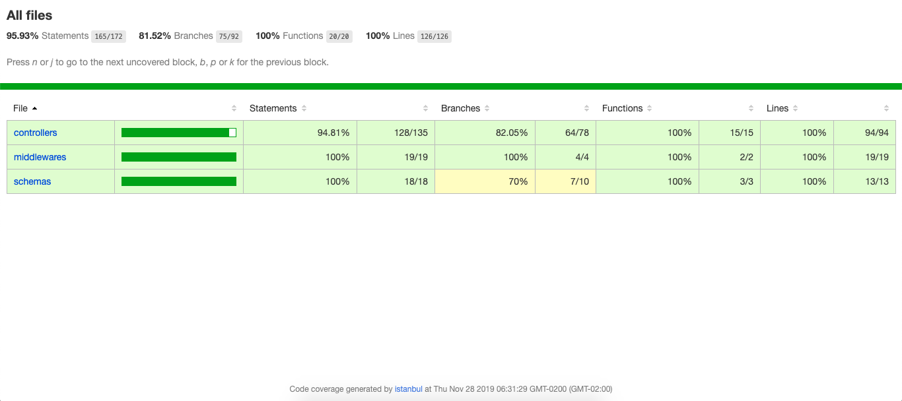

# Challenge-LiveOnSolutions

### How install

#### :rocket: Backend

- yarn install (install dependencies)
- yarn start (to open the server)
- yarn test (to open the tests with jest)

### Documentation

- navigate to ‘public/apidoc/index.html’

### Routes

- post('/user’)
- post('/session')
- put('/user');

- get('/pokemon')
- get('/pokemon/details/:name')
- post('/pokemon/:name')
- put('/pokemon/:name')
- delete('/pokemon/:name')

### :rocket: Dependencies used

- axios
- dotenv
- express
- mongoose
- jest
- @shelf/jest-mongodb
- bcryptjs
- express-async-errors
- jsonwebtoken
- suportest
- youch
- yup

#### 3. Resume of tests

---

Made with ♥ by [Jonathan](https://www.linkedin.com/in/jonathan-barros-franco)
